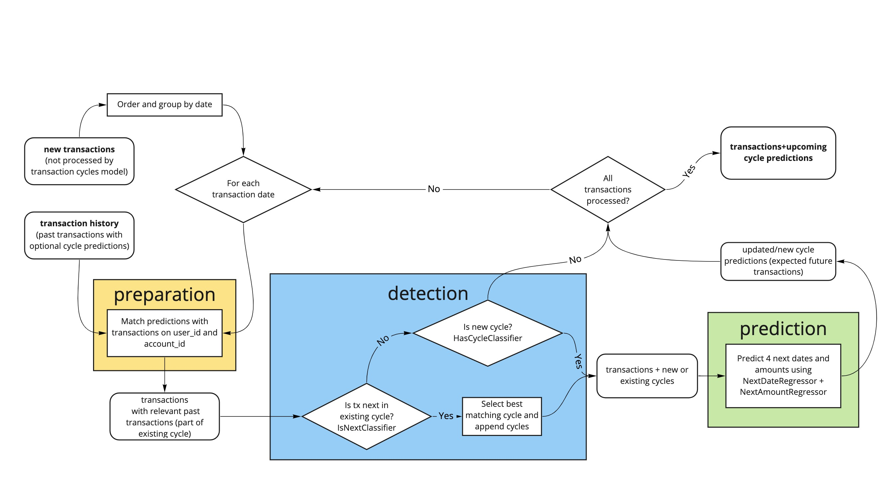
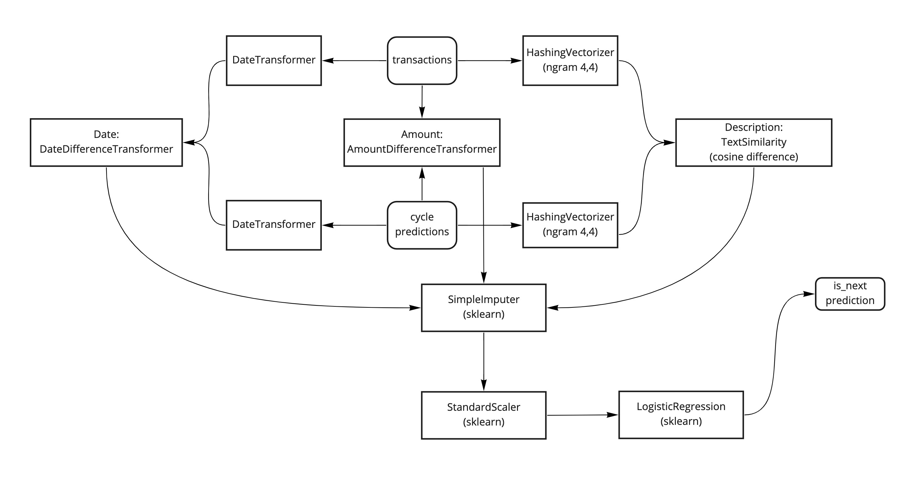
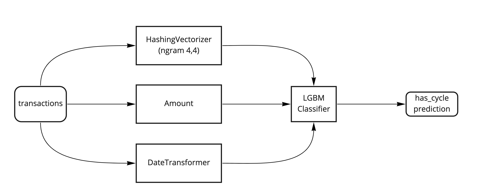
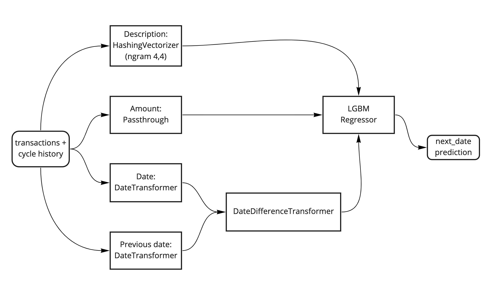
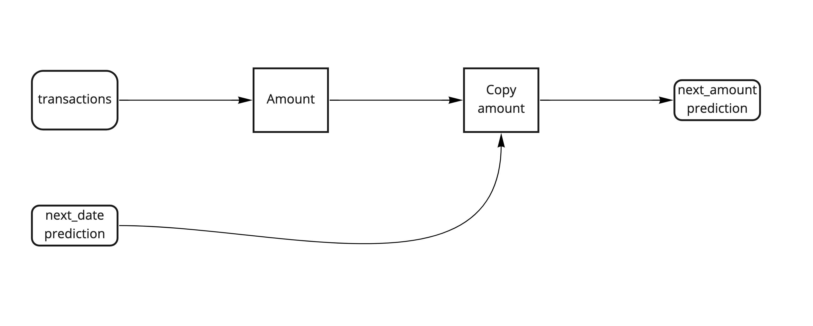
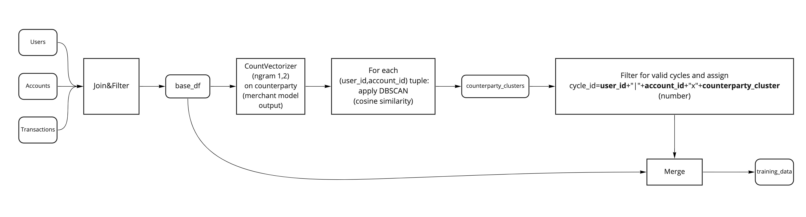

# Transaction-cycles-model

## Environment Setup

You may see the following error related to lightgbm after running pytest:
```
E   OSError: dlopen(/Users/user/opt/miniconda3/envs/transaction-cycles-model/lib/python3.7/site-packages/lightgbm/lib_lightgbm.so, 0x0006): Library not loaded: /usr/local/opt/libomp/lib/libomp.dylib
```

To resolve this then you will need to install the libomp package by running the following in your terminal:

```
brew install libomp
```

## Model Summary

- Service that detects recurring transactions (a.k.a. cycles) and predicts upcoming transactions
- Machine learning-based algorithm
- First targeted use case in YTS: detecting recurring income and payments.

## Context

The transaction cycles model originated from YoltApp.
The aim of transaction cycles model is to detect and predict transaction cycles:
recurring series of transactions with a similar description, amount and an evident periodicity (e.g. weekly, monthly).
These predictions are continuously used, among other things, to enable subscription management and predict upcoming recurring debits.

### Past (YoltApp) usage

- Used in subscriptions tab in the app
- Income cycles are used to trigger windfall jar boosters
- Predictions can trigger a insufficient balance notification
- Output is used as input to the CANDY model
- Output is used by DECS for various analytics

### Current (including YTS) usage

- Output is available via the [transaction enrichments API](https://developer.yolt.com/reference#tag/transaction-enrichments)
- Output will be used in CashFlow Analyser (CFA) to identify recurring payments/income
- Output to be used as input to a modified CANDY model

## Problem statement

We start out with a sequence of transactions and for each transaction in this sequence, we want to know

1. its cycle ID if applicable (the detection step) and
1. a list of predicted upcoming transactions (the prediction step).\
   `(Transaction, State) -> CycleId`\
   `Cycle -> List(Upcoming(CycleId, Amount, Date)))`

To convert this to a practical learning problem, we could use a combination of several models working in concert to provide all the required outputs.\
`(Transaction, State) -> (CycleId, List(Upcoming(CycleId, Amount, Date)))`

## Solution

### Prediction algorithm

The prediction algorithm consists of three phases.

1. Preparation: Match current predictions with new transactions based on `date`, `user_id` and `account_id`
1. Detection: Detect if a transaction is part of an existing cycle or the start of a new cycle.
1. Prediction: Predict amounts and dates of the next 4 expected transactions for detected cycles.



### In more detail the prediction algorithm consists of the following steps:

**if** user has existing upcoming transactions **then**  
&nbsp;&nbsp;**for each** upcoming transaction u **do**  
&nbsp;&nbsp;&nbsp;&nbsp;predict match probability with *IsNextClassifier(t, u)*  
&nbsp;&nbsp;**end for**  
&nbsp;&nbsp;**if** there is a match probability higher than threshold **then**  
&nbsp;&nbsp;&nbsp;&nbsp;find highest scoring upcoming match and retrieve previous transaction *t'*  
&nbsp;&nbsp;&nbsp;&nbsp;predict 4 next dates d with *NextDateRegressor(t, t')*  
&nbsp;&nbsp;&nbsp;&nbsp;predict 4 next amounts a with *NextAmountRegressor(t, t')*  
&nbsp;&nbsp;&nbsp;&nbsp;store *(t, d, a)* as new upcoming  
&nbsp;&nbsp;**end if**  
**else then**  
&nbsp;&nbsp;predict new cycle probability with *HasCycleClassifier(t)*  
&nbsp;&nbsp;**if** new cycle probability is above threshold **then**  
&nbsp;&nbsp;&nbsp;&nbsp;predict 4 next dates d with *NextDateRegressor(t)*  
&nbsp;&nbsp;&nbsp;&nbsp;predict 4 next amounts a with *NextAmountRegressor(t)*  
&nbsp;&nbsp;&nbsp;&nbsp;store *(t, d, a)* as new upcoming  
&nbsp;&nbsp;**end if**  
**end if**  

### The models

The transaction-cycles-model is an ensemble of four models that allow prediction of new and existing transaction cycles:

1. `IsNextClassifier`
   A classifier that tells us whether a given transaction is the next transaction in a cycle,
   given the next predicted occurrence of a cycle.\
   Signature: `(Transaction, Upcoming) -> Bool` Upcoming are retrieved from a database.



2. `HasCycleClassifier`
   A classifier that tells us whether a given transaction has a cycle attached to it.\
   Signature: `Transaction -> Bool`



3. `NextDateRegressor`
   A regression model that will provide use with the estimated number of days until the next occurrence.\
   Signature: `(Transaction, PreviousCycleTransaction) -> Int`



4. `NextAmountRegressor`
   A regression model that predicts the amount of the next occurrence.\
   Signature: `(Transaction, PreviousCycleTransaction) -> Float`
   We can just start with the last amount at which point we do not need to input other cycle information but just the current transaction.
   Together with the predicted date from `NextDateRegressor`, this information is stored in a database as entity Upcoming



5. Optionally, we may need a fifth model: `isSubscriptionClassifier`
   A classifier that tells us whether a given cycle is a subscription or not. The algorithm will detect all types of cycles, but in the app we have a special use for cycles of the type “subscription”, which we do not want to depend on categories. Signature: Cycle -> Bool
   `Upcoming` has the attributes `predicted_amount, predicted_descriptions, predicted_date`. `PreviousCycleTransaction` has the attributes `previous_amount, previous_date`.
   These models are wrapped in a class `TransactionCyclesModel` that combines them and executes the prediction logic described in the [Prediction algorithm](#prediction-algorithm) section above.

### Preprocessing

The models in the transaction-cycles-model need to be trained. Training data is automatically generated according to the following steps:

1. Select and sample transactions from YoltApp and YTS:
   1. YoltApp
      1. FR+IT+GB with client id off YoltApp `297ecda4-fd60-4999-8575-b25ad23b249c`
      1. Transactions between 2018-09-01 and 2020-09-01
      1. Random 20K users sample
   1. YTS
      1. NL with client id of Jortt  `3e3aae2f-e632-4b78-bdf8-2bf5e5ded17e`
      1. Random 5K users sample
   1. As starting point a dataframe will be created with relevant transactions by joining the `Users`, `Accounts` and `Transactions` tables from both YoltApp and YTS data
   1. The resulting `base_df` is used for generating training data.
1. Within each user and account search for clusters based on the counterparty field.
   - For counterparty preprocessing CountVectorizer on words: both 1-grams and 2-grams.
   - For clustering DBScan is used. The epsilon parameter was set based on few manual tests made (slightly higher value was prefered to not miss any crucial transactions, but also not too high to not group completely different transactions)
1. Set counterparty_cluster to -1 for predefined counterparty/descriptions that should never yield a transaction cycle, so that these will not be considered for step 6.
1. Search for a cycle within a group of user_id, account_id, counterparty_cluster
   1. Allow for the following periodicity: weekly, biweekly, monthly, bimonthly, quarterly
      1. For each period we define an offset which varies between 2 days for weekly cycles and 5 days for quarterly cycles.
   1. For every transaction in a group we check whether we can find transactions with an approximately regular spacing between dates (period +- offset). This search starts from the lowest period - weekly cycle - and checks the next periods accordingly:
      1. The minimum required length for a cycle is three transactions.
      1. If there are multiple candidates based on date, we look for the candidate with the closest amount to the mean.
      1. Once a transaction is matched, it is no longer considered as a potential starting point for new cycle.
   1. If more than two cycles are found within the group (user_id, account_id, counterparty_cluster), do not assign a cycle_id to any of these cycles.
   1. Example: suppose we have a sequence of 5 transactions belonging to the same user_id, account_id, and counterparty_cluster, where the amounts are all the same and dates are given by: \[2020-01-01, 2020-01-08, 2020-01-15, 2020-01-22, 2020-02-01, 2020-03-01\] → result: transactions 1 to 4 will form a weekly cycle. Transactions 5 and 6 will not be part of a cycle.



### Old and new cycles

In case of a new cycle (first incoming transaction), the `IsNextClassifier` will return False for all upcoming candidates.
However, the `HasCycleClassifier` will return True and initiate a new cycle.
Likewise, when the `HasCycleClassifier` fails to detect the first transaction, the current algorithm will never pick up that cycle.
When the `HasCycleClassifier` did detect the first transaction, new upcoming predictions are made, which are associated with the new cycle.
Now, when the next transaction comes in, the `IsNextClassifier` will return True for the matching cycle, and the cycle continues.
Note: for this algorithm to work, the transactions must arrive in order!

### Predicting upcoming

The `TransactionCyclesModel` will make four predictions for each detected cycle transaction.
We chose four, because then for the smallest period cycles (weekly) we predict upcoming transactions 28 days ahead.
These predictions are made by first predicting one step ahead (with the logic outlined in lines 7-8/14-15 of the prediction algorithm above)
and then feeding this new predicted transaction back into the same prediction algorithm recursively.
After receiving the four predictions back as output, the transaction-cycles service (client) will select only
predictions that are within 28 days of now and send those to Kafka as payment-cycle events/payload (see Architecture below).

### Date shifting and deleting cycles

If a predicted upcoming transaction for today did not arrive today,then we shift the predicted date plus one day.
We only send this corrected upcoming prediction as an event; we do not store it, but rather keep the original (wrong) prediction.
We do this for three days maximum.
If, on fourth day, the model (in this case it concerns isNextClassifier) has still not detected that the predicted transaction has arrived,
then we mark the cycle as “model_deleted”.
We stop “tracking” this cycle, and it is not considered by the model any longer (all its predicted upcoming transactions have a date in the past).

### User feedback

If a user gives positive feedback on a transaction (i.e. “Mark this transaction as a cycle”),
we create new "manual" prediction based on the period specified by the user.
The model will then pick up the cycle when the next transaction in that cycle comes in (in theory).
We need to experiment with this feature, as it may not give users enough control over their custom cycles.
If user gives negative feedback  (i.e. “Delete this cycle”), then we mark the cycle "user_deleted".
In this case, the detection and prediction of the cycle by the model is still happening in shadow mode to keep track of the cycle,
to prevent the cycle to be re-detected over and over again.

### Retroactive repair

The realtime model will probably miss some very user-specific cycles e.g. a monthly transfer from a family member,
because the description does not contain enough information.
One way to improve this issue is to retroactively repair these cycles after running the training data creation algorithm.
If we find new cycles here (just because there were three or more evenly spaced transactions from a similar counterparty)
we can resend these transactions to the `transaction-cycles` pod with an additional flag e.g. `{has_cycle: True, average_days_between_transactions: 30.4}`.
The model will then most likely continue the cycle as expected.
This way, we make sure we rival the old system’s performance, even in these case that can only be detected after three or more recurrences.
